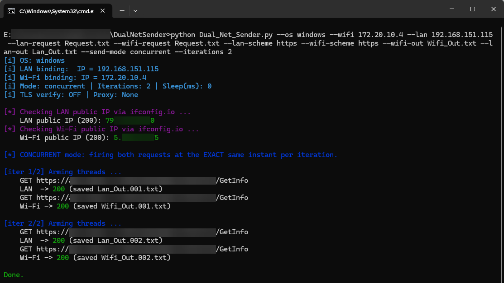

> 🛡️ **Pentest/Bug Bounty use:** This tool is designed for authorized penetration testing and bug bounty scenarios, particularly to test race-condition vulnerabilities across distinct network paths.

# 🛡️  Race-Condition Attacks (Using 2 Uplinks) for Pentesters & Bug Bounty


A Python tool to send **two HTTP requests at (virtually) the same time** through **two different network paths** (e.g., LAN & Wi‑Fi). It’s designed to help you probe **race‑condition** behavior in web applications and APIs using real request data (e.g., raw requests exported from Burp Suite).

> **Legal note:** Use only against systems you own or are explicitly authorized to test. You are responsible for your use of this tool.

---

## ✨ Features

- 🔹 **Two paths, two egresses**: Bind each request to a **local source IP** (portable) or to a **specific interface** (via `pycurl`) so the OS routes them over different networks.
- 🔹 **True simultaneous fire (race mode)**: Starts both requests on a **synchronization barrier**, so they enter the network stack at the same instant. Supports multiple **iterations** to improve odds of hitting a race.
- 🔹 **Burst‑All firing**: with `--send-mode / -sm concurrent --multi-connection / -mc`, the tool fires **all requests from all iterations at the same instant** (e.g., 10 iterations ⇒ 20 requests launched together).
- 🔹 **Burp‑style raw requests**: Read requests exactly as exported from Burp (`METHOD /path HTTP/1.1`, headers, blank line, raw body).
- 🔹 **HTTP transcript output**: One output file per request per iteration in a real HTTP transcript format:
  ```
  HTTP/2 200 OK
  Content-Type: Application/json
  ...

  { 
      "Parameter-1": "Vaule-1"
  }
  ```
- 🔹 **Auto‑decode responses**: Transparently decodes `Content‑Encoding: br` (Brotli), `gzip`, and `deflate` when possible. If the decoded body is UTF‑8, it’s written as text; otherwise raw bytes are written.
- 🔹 **Proxy support**: Route everything through an intercepting proxy (e.g., Burp) with `--proxy / -p http://127.0.0.1:8080`.
- 🔹 **Public IP check**: Shows the public IP observed for each path via `https://ifconfig.io/ip`, so you can confirm distinct egresses.
- 🔹 **Colorized console**: Uses `colorama` to highlight status and steps.
- 🔹 **TLS control**: `--verify-tls / -vt` enables certificate verification (recommended). If disabled, HTTPS warnings are suppressed for cleaner output.
- 🔹 **Note - Proxy Support**: This feature is for debug mode only. When using this feature, requests will be sent from an interface. 
---

## 🛠 How it works (High‑Level)

1. **Parse requests** from two raw files (Burp format).
2. **Build URLs** using the file’s absolute URL or its `Host` header + `--*-scheme`.
3. **Bind path** either by **local IP** (via `requests` + custom adapter) or by **interface name** (via `pycurl`).
4. **Race mode**: Two options
   - **Pairwise concurrent**: per iteration, two threads wait on a barrier and issue LAN+Wi‑Fi at the same instant.
   - **Burst‑All**: create `2 × iterations` threads and release a single barrier so **all requests across all iterations** launch together.
5. **Write output** as a single HTTP transcript per request per iteration: status line, headers, blank line, decoded body (if possible). Filenames get a **`.NNN`** suffix per iteration.

---

## 📦 Requirements

- Python 3.8+
- Packages:
  - `requests` — HTTP client for local‑IP binding
  - `colorama` — colored console output
  - `brotli` *or* `brotlicffi` — **optional**, needed to decode `Content‑Encoding: br`
  - `pycurl` — **optional**, only needed if you prefer binding by interface name (e.g., `eth0`, `en0`)

Create a `Requirements.txt`:
```txt
requests
colorama
brotli
pycurl
```

Install:
```bash
pip install -r Requirements.txt
```

> **Note on `pycurl`:** Installing on Windows/macOS/Linux may require system `libcurl`/SSL headers. If it’s inconvenient, you can bind by **local IP** and skip `pycurl` entirely.

---

## 💻 Usage

### Basic (bind by local IP addresses — portable)

```bash
python Dual_Net_Sender.py \
  --os / -O linux \
  --lan / -L 192.168.1.100 \
  --wifi / -W 10.0.0.100 \
  --lan / -L-request / -lq ./req_lan.txt \
  --wifi / -W-request / -wq ./req_wifi.txt \
  --lan / -L-scheme / -ls https \
  --wifi / -W-scheme / -ws https \
  --lan / -L-out / -lo ./out/lan.http \
  --wifi / -W-out / -wo ./out/wifi.http \
  --send-mode / -sm concurrent \
  --iterations / -i 50
```

### Bind by interface names (requires `pycurl`)

```bash
python Dual_Net_Sender.py \
  --os / -O macos \
  --lan / -L en0 \
  --wifi / -W en1 \
  --lan / -L-request / -lq ./req_lan.txt \
  --wifi / -W-request / -wq ./req_wifi.txt \
  --lan / -L-out / -lo ./out/lan.http \
  --wifi / -W-out / -wo ./out/wifi.http \
  --send-mode / -sm concurrent \
  --iterations / -i 50
```

### With intercepting proxy (e.g., Burp at 127.0.0.1:8080)

```bash
python Dual_Net_Sender.py \
  --os / -O linux \
  --lan / -L 192.168.1.23 \
  --wifi / -W 10.0.0.55 \
  --lan / -L-request / -lq ./req_lan.txt \
  --wifi / -W-request / -wq ./req_wifi.txt \
  --lan / -L-out / -lo ./out/lan.http \
  --wifi / -W-out / -wo ./out/wifi.http \
  --send-mode / -sm concurrent \
  --iterations / -i 10 \
  --proxy / -p http://127.0.0.1:8080
```
### 🔥 Burst‑All (fire **all iterations** at once)

```bash
python Dual_Net_Sender.py \
  --os / -O linux \
  --lan / -L 192.168.1.23 \
  --wifi / -W 10.0.0.55 \
  --lan / -L-request / -lq ./req_lan.txt \
  --wifi / -W-request / -wq ./req_wifi.txt \
  --lan / -L-scheme / -ls https \
  --wifi / -W-scheme / -ws https \
  --lan / -L-out / -lo ./out/lan.http \
  --wifi / -W-out / -wo ./out/wifi.http \
  --send-mode / -sm concurrent \
  --iterations / -i 10 \
  --multi-connection / -mc
```


### Sequential mode

```bash
python Dual_Net_Sender.py \
  --os / -O windows \
  --lan / -L 192.168.1.23 \
  --wifi / -W 10.0.0.55 \
  --lan / -L-request / -lq .\req_lan.txt \
  --wifi / -W-request / -wq .\req_wifi.txt \
  --lan / -L-out / -lo .\out\lan.http \
  --wifi / -W-out / -wo .\out\wifi.http \
  --send-mode / -sm sequential
```

---

## ⚙️ CLI options (complete)

| Option | Required | Example | Purpose |
|---|---|---|---|
| `--os / -O {windows,linux,macos}` | ✅ | `--os / -O linux` | Used for logs/validation. |
| `--lan / -L` | ✅ | `--lan / -L 192.168.1.23` or `--lan / -L eth0` | Choose binding for the **first** request: either a **local source IP** or an **interface name** (interface requires `pycurl`). |
| `--wifi / -W` | ✅ | `--wifi / -W 10.0.0.55` or `--wifi / -W wlan0` | Binding for the **second** request: local IP or interface name. |
| `--lan / -L-request / -lq` | ✅ | `--lan / -L-request / -lq ./req_lan.txt` | Path to the **raw HTTP** request file for the LAN path. |
| `--wifi / -W-request / -wq` | ✅ | `--wifi / -W-request / -wq ./req_wifi.txt` | Path to the **raw HTTP** request file for the Wi‑Fi path. |
| `--lan / -L-scheme / -ls {http,https}` | ▫️ | `--lan / -L-scheme / -ls https` | If request line is not absolute URL, provides the scheme to use. |
| `--wifi / -W-scheme / -ws {http,https}` | ▫️ | `--wifi / -W-scheme / -ws https` | Same as above, for Wi‑Fi request. |
| `--lan / -L-out / -lo` | ✅ | `--lan / -L-out / -lo ./out/lan.http` | **Base filename** for LAN output transcript. Iterations append `.NNN` before extension. |
| `--wifi / -W-out / -wo` | ✅ | `--wifi / -W-out / -wo ./out/wifi.http` | Base filename for Wi‑Fi output transcript. |
| `--verify-tls / -vt` | ▫️ | `--verify-tls / -vt` | Enable certificate verification for HTTPS (recommended). If omitted, warnings are suppressed automatically. |
| `--timeout / -t <seconds>` | ▫️ | `--timeout / -t 20` | Per‑request timeout. |
| `--proxy / -p <url>` | ▫️ | `--proxy / -p http://127.0.0.1:8080` | Intercept both requests & the public‑IP checks through a proxy. **This feature is for debug mode only. When using this feature, requests will be sent from an interface.**|
| `--send-mode / -sm {sequential,concurrent}` | ▫️ | `--send-mode / -sm concurrent` | Choose between **sequential** or **barrier‑synchronized** concurrent sending. |
| `--iterations / -i <N>` | ▫️ | `--iterations / -i 100` | Run N synchronized pairs (useful for race testing). |
| `--sleep-ms-between-iters / -si <ms>` | ▫️ | `--sleep-ms-between-iters / -si 0` | Sleep between iterations (helps with rate limits or server cooldowns). |

---

## 📂 File layout

```
.
├── Dual_Net_Sender.py   # main tool
├── Requirements.txt     # dependencies
└── README.md            # this document
```

> If you prefer a different filename (e.g., `race_tester.py`), adjust commands accordingly.

---

## 📨 Request File format (input)

Each request file should be a **raw HTTP request** (Burp export):

```
POST /api/v1/example HTTP/1.1
Host: example.com
User-Agent: Mozilla/5.0 ...
Content-Type: application/json
Accept: application/json
Content-Length: 27

{
    "Param-1":"Value-1"
}
```

- Absolute URLs in the request line (e.g., `POST https://example.com/api ...`) are also supported.
- Bodies can be **JSON**, **x‑www‑form‑urlencoded**, **multipart**, etc. The raw body is sent as‑is.
- The tool **ignores** any `Content-Length` header (the client computes it).

---
## 📂 Output PoC



---
## 📄 Output Format (one file per request per iteration)

Each output file is an HTTP transcript:

```
HTTP/2 200 OK
Date: Sat, 09 Aug 2025 10:08:17 GMT
Content-Type: application/json; charset=utf-8
Vary: Accept-Encoding
X-Request-ID: 1d8031892e...
Server: ArvanCloud
...

{
    "Parameter-1":"Value-1",
    "Parameter-2":"Value-2"
}
```

- If the body is compressed (`br`, `gzip`, `deflate`), the tool tries to **decode** it first.
- If the decoded body is UTF‑8, it is written as **text**; otherwise raw bytes are written.
- When running multiple iterations, files are suffixed: `Lan_Out.001.http`, `Lan_Out.002.http`, etc.

---

## 🌐 Verifying different egress IPs

The tool fetches `https://ifconfig.io/ip` on each path and prints the observed **public IP**. If both paths exit through the same NAT, they may have the **same public IP** even if you bound different local IPs. For stricter separation, use different uplinks (e.g., Wi‑Fi vs. cellular hotspot, or a split‑tunnel VPN bound to one interface).

---

## ⏱ Race‑Condition Testing Notes

- The barrier ensures both threads hit the network stack **at the same instant**. After that, timing jitter can still occur due to OS scheduling, DNS/TLS handshakes, NIC/driver, and routing.
- To improve the odds of triggering races: use **concurrent** mode with **many iterations** (e.g., `--iterations / -i 200`), minimal think time (`--sleep-ms-between-iters / -si 0`), and keep paths warm (reuse the same host and session state if applicable). Avoid the proxy if you don’t need interception.
- If the server has very fine‑grained race windows (sub‑millisecond), you’ll need many attempts and possibly lab‑side proximity to the target network.

---

## 🖥 Platform Notes

- 🔹 **Windows**: Binding by **local IP** works out of the box. For interface‑name binding (`pycurl`), install a compatible `libcurl` and SSL backend.
- 🔹 **macOS / Linux**: Both modes are supported. Interface names look like `en0`, `en1` (macOS) or `eth0`, `wlan0` (Linux).

---

## 🐞 Troubleshooting

- 🔹 **Output looks like gibberish**: It’s probably compressed (`Content‑Encoding: br/gzip/deflate`). Install `brotli` (or `brotlicffi`). The tool auto‑decodes and writes readable text when possible.
- 🔹 **Both paths show the same public IP**: Your uplinks share a NAT. Use truly separate egresses (hotspot/VPN/split‑tunnel).
- 🔹 **`pycurl` install issues**: Skip interface‑name binding and use **local IP** binding (works with `requests` alone).
- 🔹 **TLS warnings**: Use `--verify-tls / -vt` to enable certificate verification. If omitted, the tool suppresses the warning automatically.
- 🔹 **Using `--multi-connection / -mc` stalls or errors**: The burst may exceed local socket/file limits or proxy capacity. Reduce `--iterations / -i`, remove the proxy, or raise OS limits.


## ⚠️ Disclaimer

This tool is for **Authorized Testing and Research**. 